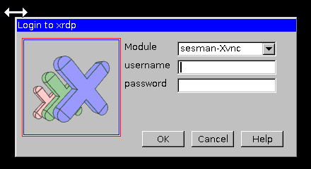

# Java Development with VSTS Hands on Labs


These hands on labs allow you to explore how VSTS works in a Linux environment with [Visual Studio Team Services (VSTS)](https://www.visualstudio.com/en-us/products/visual-studio-team-services-vs.aspx), [Eclipse](https://eclipse.org/downloads/) and [Team Explorer Everywhere](https://www.visualstudio.com/en-us/products/team-explorer-everywhere-vs.aspx). This combination of tools and technologies allows you to leverage the Microsoft DevOps platform for Java development. 

The [labs](labs/readme.md) use a pre-built virtual machine image that is preconfigured with all the software you require to run through the labs.  To use the labs, you will run a copy of this image in your own Azure subscription.

> We've recorded some short videos that intro each lab. Check out this [playlist on YouTube](https://youtu.be/O1UTj-wZr3k?list=PLu1D89Nlvq9hUaf-wdBXVcKfQiqY7Y0AI).

Instead of manually creating the resources in Azure, you are going to use Azure Resource Management (ARM) templates.

If you require assistance with these labs, contact Northwest Cadence through our [website](http://nwcadence.com).

**Tasks**

1. Provision the Storage Account
2. Use AzCopy to copy the image to your storage account
3. Provision the VM and dependent resources

## Task 1: Provision the Storage Account
    
1. Create a new storage account.
    
    Simply click the Deploy to Azure button below and follow the wizard to create a storage account. You will need to log in to the Azure Portal.
                                                                     
	<a href="https://portal.azure.com/#create/Microsoft.Template/uri/https%3A%2F%2Fraw.githubusercontent.com%2Fnwcadence%2Fjava-dev-vsts%2Fmaster%2FJavaDevVSTS-Storage.json" target="_blank">
		
	</a>
	<a href="http://armviz.io/#/?load=https%3A%2F%2Fraw.githubusercontent.com%2Fnwcadence%2Fjava-dev-vsts%2Fmaster%2FJavaDevVSTS-Storage.json" target="_blank">
		
	</a>

    The storage account will be deployed to a Resource Group. You can delete the resource group in order to remove all the created resources at any time.

1. Specify settings for the deployment
    
    You will need to select a subscription and region to deploy the Resource Group to.

1. Check the Resource Group in the Azure Portal
    When the deployment completes, you should see a resource group with a single storage account resource.


## Task 2: Use AzCopy to Create a Copy of the Lab VM Image

1. Download and install AzCopy

	Download and install the latest version of AzCopy from here: http://aka.ms/downloadazcopy

1. Obtain your storage account access key.

	In the Azure portal, go to your storage account settings tab
	Click Access Keys
	Copy the primary storage key

1. Run the following AzCopy command substituting your own values for the storage account name and key.

	```
	"%PROGRAMFILES(x86)%\Microsoft SDKs\Azure\AzCopy\AzCopy.exe" /Source:https://vstsjl2016vhd.blob.core.windows.net/vhd /Pattern:"vstsjlvhd082416.vhd" /Dest:YOUR_STORAGE_ACCOUNT_URI /DestKey:YOUR_STORAGE_ACCOUNT_KEY
	```

	`YOUR_STORAGE_ACCOUNT_URI` - should be in the format of https://YOUR_STORAGE_ACCOUNT_NAME.blob.core.windows.net/vhd

	It will take approximately 10 minutes to copy the image to your storage account.

> **For Linux/Mac**, AzCopy is not available for Mac/Linux OSs. However, Azure CLI is a suitable alternative for copying data to and from Azure Storage. Read [Using the Azure CLI with Azure Storage](https://docs.microsoft.com/en-us/azure/storage/storage-azure-cli) to learn more.
> You may want to use a command like: *azure storage blob copy start --source-uri https://vstsjl2016vhd.blob.core.windows.net/vhd/vstsjlvhd082416.vhd  --dest-blob <BLOB_NAME> --dest-container <CONTAINER_NAME> -c <YOUR_STORAGE_CONNECTION_STRING>*

> **Update** Azure team has made it easy to run Azure CLI commands from the Azure portal directly through [Azure Cloud Shell](https://docs.microsoft.com/en-us/azure/cloud-shell/overview) an interactive, browser-accessible shell for managing Azure resources.

## Task 3: Provision the VM and Dependent Resources

1. Create the VM and dependent resources.
    
    Simply click the Deploy to Azure button below and follow the wizard to create the resources. You will need to log in to the Azure Portal.
                                                                     
	<a href="https://portal.azure.com/#create/Microsoft.Template/uri/https%3A%2F%2Fraw.githubusercontent.com%2Fnwcadence%2Fjava-dev-vsts%2Fmaster%2FJavaDevVSTS-VM.json" target="_blank">
		
	</a>
	<a href="http://armviz.io/#/?load=https%3A%2F%2Fraw.githubusercontent.com%2Fnwcadence%2Fjava-dev-vsts%2Fmaster%2FJavaDevVSTS-VM.json" target="_blank">
		
	</a>

    The resources will be deployed to a Resource Group. You can delete the resource group in order to remove all the created resources at any time.

1. Specify settings for the deployment
    
    You should select the same subscription and Resource Group where you deployed your storage account to.

	Provide a public DNS name

	Provide the URI to the vhd which should look like this: https://YOUR_STORAGE_ACCOUNT_NAME.blob.core.windows.net/vhd/vstsjlvhd082416.vhd

1. Check the Resource Group in the Azure Portal
    When the deployment completes, you should see the following resources in the Azure Portal:

    

## Log in and Modify the Admin Password

Now you can remote desktop to the Virtual Machine (using the DNS name that you configured in the second ARM deployment), log in and start [the labs](labs/readme.md). When you remote into the machine, you will need to enter a username and password for xrdp:



> The name of your machine will be `<dnsName.region>`.cloudapp.azure.com. You can see this if you click on the Virtual Machine in your resource group to see the VM properties. For example, if you specified `cd-javahol` in region `westus` then the machine can be accessed by remoting to `cd-javahol.westus.cloudapp.azure.com`. 

Login using the following values:

- Username: `vmadmin`
- Password: `P2ssw0rd`

> **SECURITY NOTE**: You will need to change the password for your user once you log in so that no-one else can access your machine!

Follow these steps to change the password for the `vmadmin` user:

1. Open a terminal (double click the terminal icon on the desktop or click it in the app tray)
1. Type `passwd` and hit enter.
1. Enter the current password (`P2ssw0rd`)
1. Enter a new password
1. Confirm the new password

## Start the Labs
We've recorded some short videos that intro each lab. Check out this [playlist on YouTube](https://youtu.be/O1UTj-wZr3k?list=PLu1D89Nlvq9hUaf-wdBXVcKfQiqY7Y0AI).
