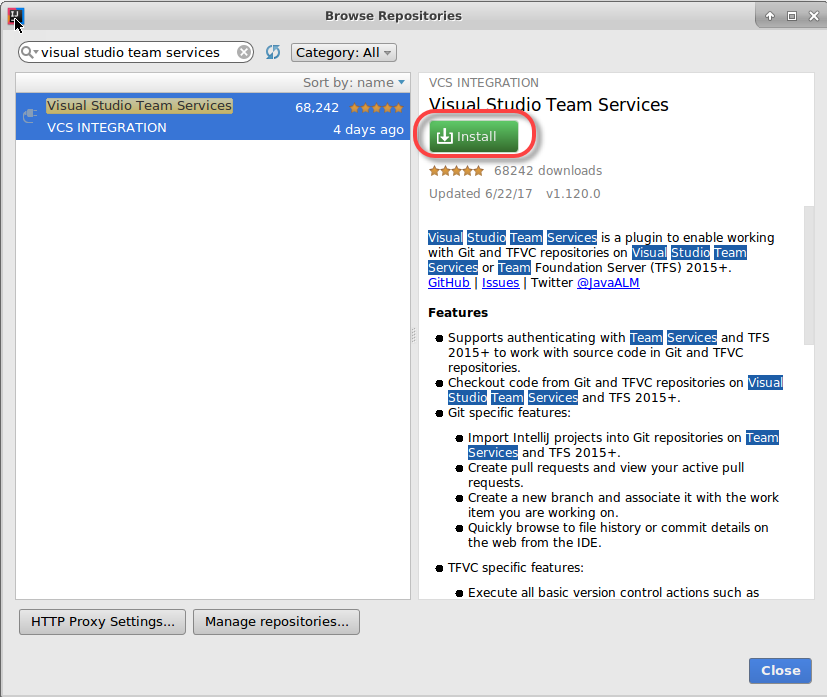
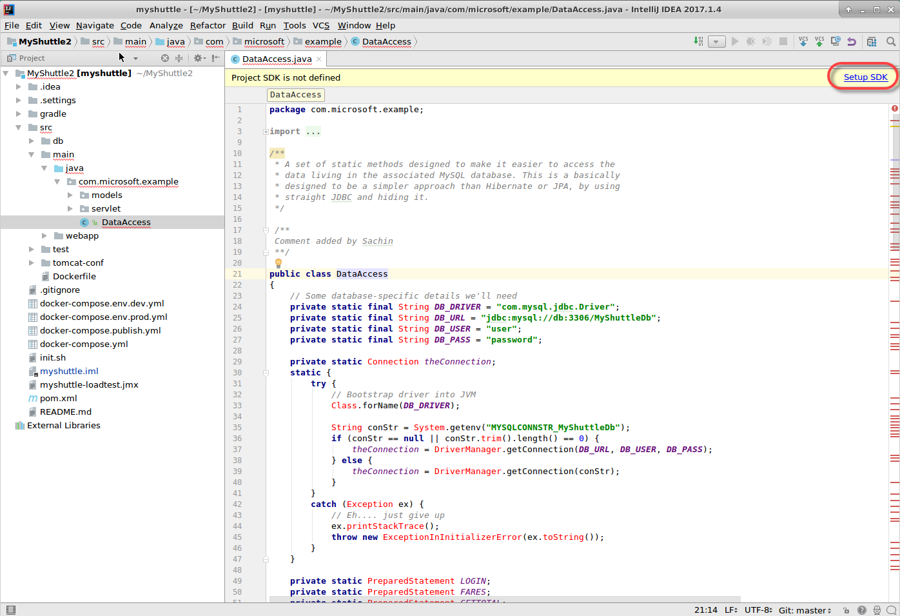
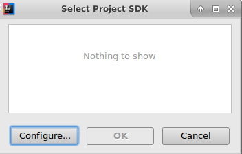
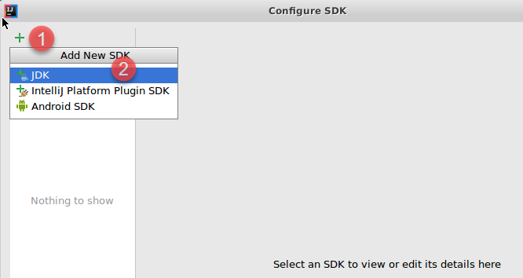
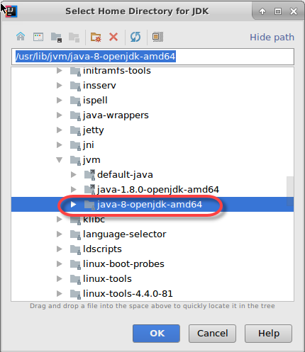

## IntelliJ - Working with Git

In this exercise, you are going to clone a Github repo into VSTS and then open clone it to your VM for editing in IntelliJ.
This exercise assumes you have completed Exercise 1, and have created a Team Project that uses Git for version control. This exercise uses a team project named **jdev**, though your team project name may differ.

> **Note**: It is not necessary to clone Github repos into VSTS. VSTS will work just fine with Github (or other Git hoster) repos. However, some linkages from source code to other aspects of the DevOps pipeline (such as work items, builds or releases) work best if the code is in VSTS.

Importing a Github Repo into VSTS
---------------------------------

In this task you will import code from a Github repo into VSTS.

1. Connect to the virtual machine with the user credentials which you specified when creating the VM in Azure.
1. Open Chrome and browse to `http://<youraccount>.visualstudio.com` (where `youraccount` is the account you created in VSTS).
1. Click on the `jdev` team project to navigate to it. Click on Code in the blue toolbar at the top to open the Code Hub.
1. Click on the repo drop-down in the upper left (in the grey toolbar) and select "New repository".

    

1. Enter the following url: `https://github.com/nwcadence/MyShuttle2.git` and click Import.

    

1. After a few moments, the code will be imported.

1. Click "Save"

Connect to VSTS from IntelliJ
-----------------------------

1. Click on the IntelliJ icon in the toolbar to open IntellJ IDEA.

    

1. The first time you run IntelliJ, it will prompt for theme settings. Click on "Skip All and Set Defaults" to use the defaults.

    

1. When the Welcome dialog appears, click Configure and then select Plugins.

    

1. In the search box type `visual studio team services` and click the "Search in repositories" link in the main window.

    

1. Click install to install the extension. The install button will change to a "Restart" button - click it to restart IntelliJ.

    

1. When IntelliJ restarts, the Welcome dialog will appear again. Click "Check out from Version Control" and select "Team Services Git".

    

1. Click on "Sign in..." to sign in to your VSTS account.

    

1. Once you have authenticated, enter "MyShuttle2" into the search bar and select the MyShuttle2 repo from your team project. Click the Clone button to clone the repo to the VM.

    

1. IntelliJ detects a Maven project file (pom.xml) and asks if you want to open it. Click "Yes" to open the project. You can dismiss the Tip of the Day dialog that appears.

1. Press "Alt-1" to open the Project View.
1. Expand `src\main\java\com.microsoft.example` and click on "DataAccess" to open the DataAccess class.
1. A yellow warning appears in the main editor window prompting you to "Setup SDK". Click on the link.

    

1. In the Select Project SDK dialog, click "Configure..."

    

1. In the upper left, click the green "+" icon to add a new SDK.

    

1. Select `java-8-openjdk-amd64` from the folder list and click OK. Click OK back through the rest of the dialogs.

    

> **Note**: The project will not currently compile, since it has a dependency on a library (MyShuttleCalc) that it cannot resolve. You will fix this in the Package Management lab.